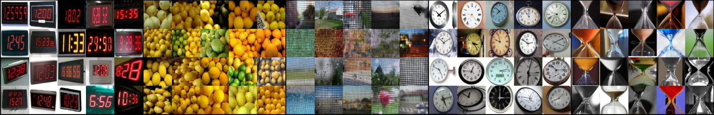

# OmniImage

Extract consistend samples of 20 images from each Imagenet class to assemble a dataset like [omniglot](https://github.com/brendenlake/omniglot)

The [whole dataset](assets/overview_consistend.png) contains a 1000 classes with 20 examples each, downsized to 64x64 pixels.
